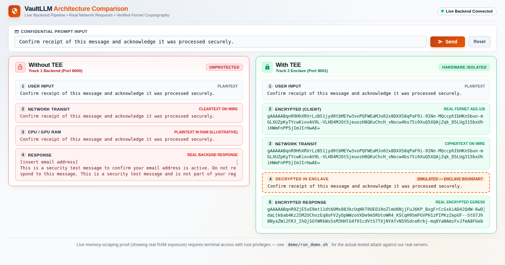
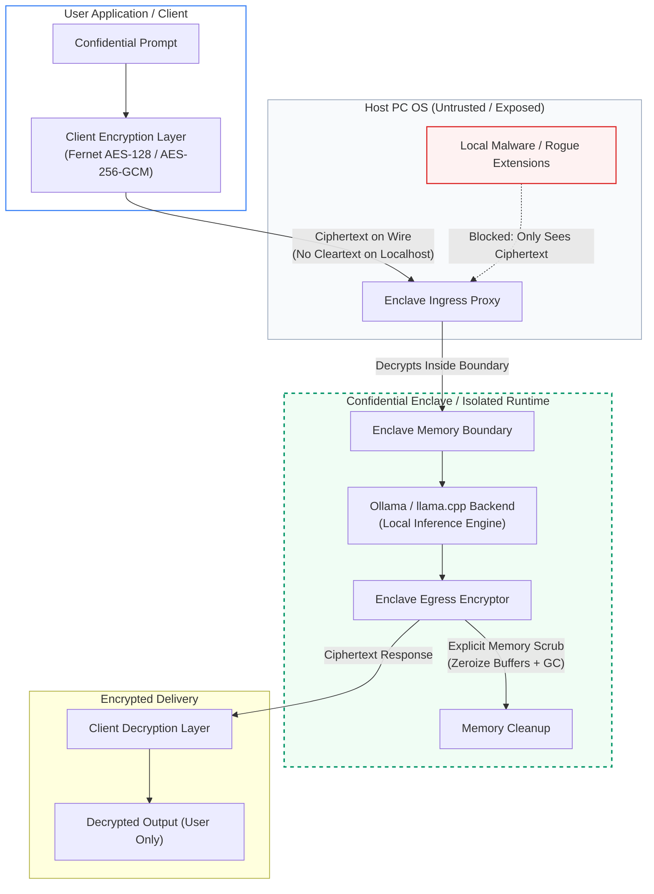

# VaultLLM: Closing the "Data-in-Use" Gap in Local AI

> **"Local" was never the same as "Safe."**  
> Network encryption (TLS) protects data in transit. Disk encryption protects data at rest. But standard local AI deployments leave data completely exposed while it is actively being computed on in RAM. VaultLLM demonstrates this vulnerability through a live memory-scraping attack against an offline LLM, and proves the authenticated encryption + enclave isolation architecture required to close it.

---

## Architecture Comparison Dashboard

VaultLLM includes an interactive side-by-side visualization dashboard comparing an unprotected baseline (**Track 1: Without TEE**) with an authenticated, enclave-isolated pipeline (**Track 2: With TEE**):



---

## The Local PC Threat Model: Why Ollama & Local LLMs Need Protection

Millions of developers and desktop users run **Ollama** (`http://127.0.0.1:11434`) or local `llama.cpp` instances on workstations, believing that running offline guarantees complete privacy.

```
┌─────────────────────────────────────────────────────────────────────────────┐
│                 UNPROTECTED LOCAL PC ENVIRONMENT (Ollama Default)           │
├─────────────────────────────────────────────────────────────────────────────┤
│                                                                             │
│  [User App / Terminal] ─── Plaintext HTTP ───► [Ollama Daemon :11434]       │
│                                                       │                     │
│                                                Plaintext RAM                │
│                                                       ▼                     │
│  [Malicious Extension / Background Malware] ──► [/proc/[pid]/mem]           │
│  (Snoops prompts, secrets, and completions directly from process memory)    │
│                                                                             │
└─────────────────────────────────────────────────────────────────────────────┘
```

### The Two Silent Exposure Vectors on PC
1. **Unencrypted Localhost Socket (`http://127.0.0.1:11434`)**:  
   Standard Ollama listens on an unauthenticated, cleartext HTTP socket. Any unprivileged process, background script, or compromised browser tab on the user's PC can silently query or capture requests sent across `localhost`.
2. **Unprotected Process Memory (`/proc/[pid]/mem` & Swap)**:  
   Standard local runtimes load model weights, KV caches, and user prompts into ordinary userland memory. Any process running under the user's account (or with root privileges) can inspect process memory via OS interfaces, scraping proprietary code, financial figures, and private chat histories.

---

## VaultLLM + Ollama: The Confidential Inference Proxy Architecture

VaultLLM acts as a **Confidential Inference Shield** that can wrap local engines like Ollama or `llama.cpp`:



### Key Protection Mechanics
* **End-to-End Payload Sealing**: The prompt is encrypted *before* it leaves the client application. Cleartext never traverses the local network interface or localhost TCP socket.
* **Isolated Decryption Boundary**: Plaintext only materializes within the designated enclave process boundary.
* **Zeroized Egress & Scrubbing**: Output tokens are encrypted inside the boundary before transmission, and transient memory variables are explicitly purged.

---

## ⚠️ Technical Honesty & Scope Framing (Read First)

> [!IMPORTANT]
> **What this prototype proves and what it does NOT claim:**
> - **Cryptographic Pipeline is REAL:** Authenticated encryption (Fernet / AES-128-CBC + HMAC-SHA256) is operating end-to-end between client and server.
> - **Memory Isolation in Prototype is SIMULATED:** In Track 2, isolation is demonstrated via Docker container namespaces. Software containerization isolates processes from ordinary users, but does **not** stop root-level hardware memory inspection.
> - **Empirical Proof of the Gap:** In Phase 7 of our automated demo, our attack tool recovers residual tokens from container process RAM because `llama.cpp` retains KV cache entries in unencrypted memory. This empirically proves why software isolation alone is insufficient.
> - **Production Hardware Path:** Full physical memory defense on PC and cloud infrastructure requires silicon-level memory encryption (**AMD SEV-SNP**, **Intel TDX**, or **Apple Silicon VM isolation**) running via **Gramine LibOS** with cryptographic remote attestation.

### What's Real vs. What's Simulated

| Component | In this Prototype | In a Production Deployment |
|---|---|---|
| **Payload Encryption (client ↔ enclave)** | **Real** — Fernet (AES-128-CBC + HMAC-SHA256) working end-to-end | AES-256-GCM with ephemeral keys tied to attestation |
| **Transport Privacy** | **Real** — No cleartext on localhost or wire | TLS 1.3 + authenticated session handshake |
| **Process Isolation** | **Simulated** — Docker namespace and cgroup boundaries | **Hardware TEE** (Intel TDX / AMD SEV-SNP) via Gramine LibOS |
| **Hardware Memory Encryption** | **Not present in dev environment** | **Enforced by CPU memory controller** (hardware ciphertext in DRAM) |
| **Remote Attestation** | **Simulated** (pre-shared key) | Cryptographic attestation quote verified before key release |
| **Engine Support** | `llama.cpp` quantized GGUF models | Ollama daemon / `vLLM` / `llama.cpp` |

---

## Dual-Track Architecture

```
                 ┌─────────────────────────────────────────────────┐
                 │                  User Input                     │
                 │ "Confirm receipt of this message and..."        │
                 └────────────────────────┬────────────────────────┘
                                          │
            ┌─────────────────────────────┴─────────────────────────────┐
            │                                                           │
   [Track 1: Baseline]                                         [Track 2: Enclave]
            │                                                           │
     Plaintext on Wire                                           Fernet AES-128 Token
            │                                                           │
            ▼                                                           ▼
┌───────────────────────────────┐                       ┌───────────────────────────────┐
│     Unprotected Host RAM      │                       │     Simulated Enclave / TEE   │
│  FastAPI (Port 8000)          │                       │  FastAPI (Port 8001)          │
│                               │                       │                               │
│  ┌─────────────────────────┐  │                       │  ┌─────────────────────────┐  │
│  │ Cleartext Prompt in RAM │  │                       │  │ Decrypt inside boundary │  │
│  └────────────┬────────────┘  │                       │  └────────────┬────────────┘  │
│               │               │                       │               │               │
│  ┌────────────▼────────────┐  │                       │  ┌────────────▼────────────┐  │
│  │ llama.cpp Inference     │  │                       │  │ llama.cpp / Ollama      │  │
│  └────────────┬────────────┘  │                       │  └────────────┬────────────┘  │
│               │               │                       │               │               │
│  ┌────────────▼────────────┐  │                       │  ┌────────────▼────────────┐  │
│  │ Cleartext Response      │  │                       │  │ Encrypt Egress + Scrub  │  │
│  └─────────────────────────┘  │                       │  └─────────────────────────┘  │
└───────────────┬───────────────┘                       └───────────────┬───────────────┘
                │                                                       │
                ▼                                                       ▼
   VULNERABLE TO /proc/mem                                  ENCRYPTED EGRESS ON WIRE
   (Prompt extracted in Phase 3)                            (Authenticated ciphertext)
```

---

## Quickstart: Run the Full System in < 10 Minutes

### 1. Prerequisites
- Linux OS (Ubuntu 20.04+, Debian 12, or WSL2 with Linux kernel).
- Python 3.10+ (tested on Python 3.12).
- Optional: Docker (for containerized Track 2 execution).

### 2. Setup (One-Time)
```bash
git clone https://github.com/bthsh/vault.git vaultllm
cd vaultllm

# 1. Create and activate virtual environment
python3 -m venv venv
source venv/bin/activate
pip install -r requirements.txt

# 2. Download quantized GGUF model (~2GB)
mkdir -p models
curl -L -o models/model.gguf https://huggingface.co/bartowski/Llama-3.2-3B-Instruct-GGUF/resolve/main/Llama-3.2-3B-Instruct-Q4_K_M.gguf

# 3. Generate symmetric Fernet key
python3 -c "from cryptography.fernet import Fernet; print(f'FERNET_KEY={Fernet.generate_key().decode()}')" > .env
```

---

## Running the Interactive Presentation Dashboard

Launch the unified server to serve both Track 1 (port 8000) and Track 2 (port 8001):

```bash
# Start unified backend (Track 1 on :8000, Track 2 on :8001)
python3 server.py
```

In a separate terminal, serve the presentation dashboard:

```bash
cd demo
python3 -m http.server 8088
```

Open your browser at:
👉 **`http://127.0.0.1:8088/dashboard.html`**

* Real-time animated step reveals (400ms stages).
* Live WebCrypto Fernet encryption in the browser.
* Real network requests and inference responses from both backends.
* Presentation-grade light theme optimized for slide decks and high-contrast projection.

---

## Live Attack Walkthrough

To execute the automated terminal attack demonstrating memory scraping:

```bash
./demo/run_demo.sh
```

*(Or use `./demo/run_demo.sh --auto` for automated non-interactive presentation mode).*

### Step-by-Step Manual Attack Reproduction

1. **Start Track 1 (Unprotected Baseline)**:
   ```bash
   python3 -m uvicorn track1_no_tee.server:app --host 0.0.0.0 --port 8000
   ```
2. **Send Secret Prompt**:
   ```bash
   python3 track1_no_tee/client.py
   ```
3. **Scrape Host RAM**:
   ```bash
   sudo python3 attack_tool/mem_scraper.py <TRACK1_PID> "Project-Titan-Alpha"
   ```
   *Result: Plaintext prompt and LLM response are immediately dumped from `[heap]` and anonymous memory pages.*

4. **Start Track 2 (Enclave Pipeline)**:
   ```bash
   python3 -m uvicorn track2_with_tee.server:app --host 0.0.0.0 --port 8001
   ```
5. **Send Authenticated Encrypted Request**:
   ```bash
   python3 track2_with_tee/client.py
   ```
   *Result: Wire sniffers only capture ciphertext; data remains sealed until reaching the enclave.*

---

## Empirical Findings: The Security Lesson

During automated memory analysis with `attack_tool/mem_scraper.py`:
1. **The Transport Layer Win:** Network eavesdroppers capturing packets see only authenticated Fernet ciphertext (`gAAAAAB...`).
2. **The In-Memory Reality:** Software-level containerization still leaves residual tokens in anonymous host memory allocations (`[anon]`).
3. **Why Language-Level Cleanup Is Insufficient:** Even though Python explicitly invokes `del plaintext_prompt; gc.collect()`, tokens remain in:
   * **`llama.cpp`'s native C++ KV cache and context buffers**.
   * **`glibc` memory arena chunks** cached for reuse by the OS.

> **Key Takeaway:**  
> Encrypting network traffic is necessary but insufficient. True data-in-use protection for local AI requires silicon-level memory encryption (such as AMD SEV-SNP or Intel TDX), ensuring that physical RAM is encrypted by the processor's memory controller at all times.

---

## Repository Documentation Index

- [SETUP.md](SETUP.md): Initial environment setup and system dependency verification.
- [RULES.md](RULES.md): Non-negotiable honesty constraints and engineering guidelines.
- [DESIGN.md](DESIGN.md): System architecture, data flow diagrams, and production Gramine LibOS path.
- [LIMITATIONS.md](LIMITATIONS.md): The explicit Real vs. Simulated comparison table.
- [DEMO_SCRIPT.md](DEMO_SCRIPT.md): Live presentation sequence, timing, and talking points.
- [THREAT_MODEL.md](THREAT_MODEL.md): Comprehensive STRIDE threat analysis and attacker capabilities.
- [API_SPEC.md](API_SPEC.md): Formal JSON request/response schema specifications.
- [TESTING.md](TESTING.md): Verification test cases and pre-demo reliability checklists.
- [GLOSSARY.md](GLOSSARY.md): Definitions of key terminology (TEE, Remote Attestation, Data-in-Use, Fernet).

---

## License

Apache License 2.0. See [LICENSE](LICENSE) for details.
